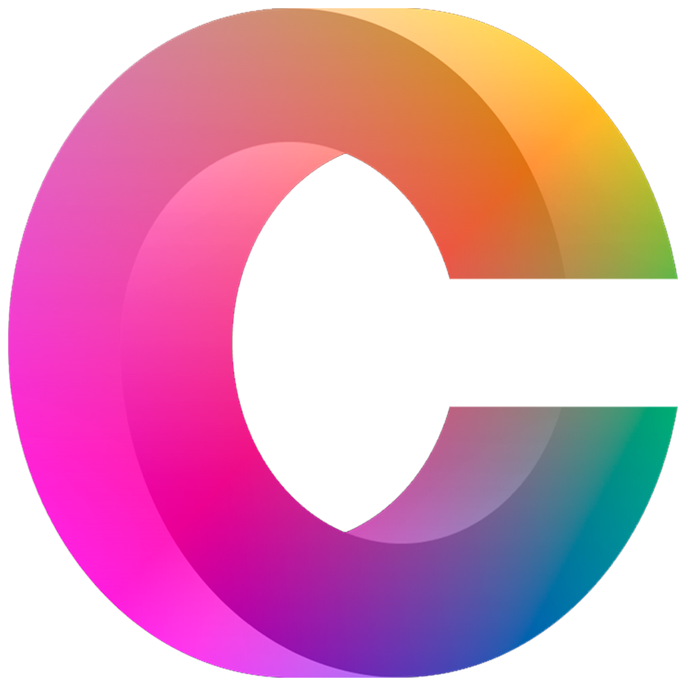

    
    
    
    

---

## Welcome

This is my first time programming a game engine. I am doing this because I don't quite like other engines. Don't get com wrong, those engines are really cool, but I prefer something else, something that I can 100% understand and modify without blowing my mind.

I never thought I would be able to do something like this, but here I am, creating a 3D game engine in java, that's crazy.

## Citadel engine

This engine is going to be used for my future games and projects, but if people really like it, I could add support for using it outside my own projects.

## Development Status

### Always In Development (⌛)
| Feature       | Status   |
|---------------|----------|
| 3D Rendering  | ⌛        |
| Optimization  | ⌛        |
| Modding API   | ⌛        |
| Documentation | ⌛        |

### Currently In Progress (🔄)
| Feature         | Status |
|-----------------|--------|
| Lighting        | 🔄     |
| Shadows         | 🔄     |
| Log System      | 🔄     |
| Profiler        | 🔄     |
| Frustum Culling | 🔄     |
| Textures        | 🔄     |
| Networking      | 🔄     |

### Planned Features (🗓️)
| Feature                  | Status |
|--------------------------|--------|
| Object Culling           | 🗓️    |
| Save System              | 🗓️    |
| Steamworks Compatibility | 🗓️    |
| GUI System               | 🗓️    |
| Particles                | 🗓️    |

### Completed Features (✅)
| Feature               | Status   |
|-----------------------|----------|
| Batching              | ✅        |
| Sound                 | ✅        |
| Registry System       | ✅        |
| Engine Configuration  | ✅        |
| ImGui                 | ✅        |
| Event System          | ✅        |

## Credits

Coded with ❤🧡💛💚💙💙💜🤎🖤🤍 by <a href="https://github.com/restonic4">restonic4</a>.

📚 = Library.
🔮 = App / Tool.

Libraries and tools used:
- <a href="https://www.lwjgl.org">📚 LWJGL 3</a>
- <a href="https://www.glfw.org">📚 GLFW</a>
- <a href="https://www.khronos.org/about/">📚 OpenGL</a>
- <a href="https://www.openal.org">📚 OpenAL</a>
- <a href="https://github.com/nothings/stb">📚 STB</a>
- <a href="https://github.com/ocornut/imgui">📚 Original ImGui</a> ---> <a href="https://github.com/SpaiR/imgui-java">📚 Java ImGui</a>
- <a href="https://github.com/netty/netty/">📚 Netty</a>
- <a href="https://gource.io">🔮 Gource</a>
- <a href="https://visualvm.github.io">🔮 VisualVM</a>

Knowledge:
- <a href="https://www.youtube.com/@GamesWithGabe">Youtube: @GamesWithGabe</a>
- <a href="https://www.youtube.com/@ThinMatrix">Youtube: @ThinMatrix</a>
- <a href="https://www.youtube.com/watch?v=f05PwswO7qc">Youtube video by @KazeN64</a>
- <a href="https://www.youtube.com/watch?v=1LCEiVDHJmc">Youtube video by @standupmaths</a>
- <a href="https://www.youtube.com/watch?v=YTfdBSjitd8">Youtube video by @Aurailus</a>
- <a href="https://ahbejarano.gitbook.io/lwjglgamedev">LWJGL book by lwjglgamedev</a>
- <a href="https://lwjglgamedev.gitbooks.io/3d-game-development-with-lwjgl/content">Another LWJGL book by lwjglgamedev</a>

For more information, check out the [docs](./resources/docs) in the `resources/docs` folder.

## License

This project is licensed under the Apache License 2.0 - see the [LICENSE](LICENSE) file for details.

## Gource

100 commits:

Next gources:
- 500 commits.
- 1k commits.
- 1 year of development.